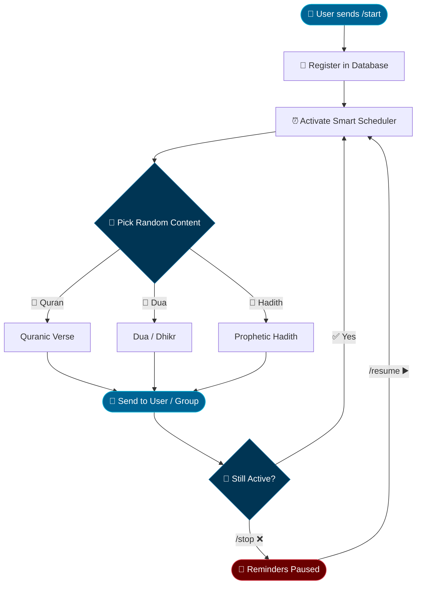

<div align="center">

<!-- ═══════════════════════════════════════ HEADER ═══════════════════════════════════════ -->


<br/>

<!-- Typing Animation -->


<br/><br/>

<!-- ═══ BADGES ROW 1 ═══ -->
<a href="https://t.me/Noorify_bot">
  
</a>
&nbsp;
<a href="https://www.python.org">
  
</a>
&nbsp;
<a href="LICENSE">
  
</a>
&nbsp;


<br/><br/>

<!-- ═══ BADGES ROW 2 ═══ -->
<a href="https://github.com/RamiDevX/Noorify_Bot/stargazers">
  
</a>
&nbsp;
<a href="https://github.com/RamiDevX/Noorify_Bot/network/members">
  
</a>
&nbsp;
<a href="https://github.com/RamiDevX/Noorify_Bot/issues">
  
</a>
&nbsp;
<a href="#">
  
</a>

</div>

---

<div dir="rtl">

## 🌙 نبذة عن المشروع

<br/>

> ✨ *"في عالم مثقل بالإشعارات الفارغة — هذا هو الإشعار الوحيد الذي يستحق أن تفتحه."*

<br/>

**نورفاي** بوت تيليغرام ذكي يُرسل لك تذكيرات إسلامية يومياً، يحوّل هاتفك والمجموعات من فضاء التشتت إلى واحات عامرة بالذكر والأذكار التفاعلية.

🎯 **رسالتنا:** نشر الذكر والأدعية والآيات القرآنية بطريقة منظمة وتفاعلية تلائم كل مستخدم.

---

## ✨ المميزات الرئيسية

<div align="center">

| الأيقونة | الميزة | الوصف |
|:---:|:---:|:---|
| 🔔 | **تذكيرات عشوائية** | آيات وأدعية وأحاديث غير متكررة كل يوم |
| ⏱️ | **جدولة ذكية** | تعمل تلقائياً في أوقات محددة بدقة عالية |
| 💬 | **دعم شامل** | دردشات خاصة، مجموعات، وقنوات |
| 🎛️ | **واجهة سهلة** | أزرار بسيطة وواضحة للتحكم الكامل |
| ⚙️ | **تحكم كامل** | ابدأ، أوقف، أو غيّر الإعدادات في أي وقت |
| 📊 | **قاعدة بيانات** | تخزين آمن وخفيف لبيانات المستخدمين |
| 🔄 | **بدون تكرار** | خوارزمية ذكية تمنع تكرار نفس المحتوى |
| 🌐 | **دعم المجموعات** | يعمل في المجموعات والقنوات بكفاءة |

</div>

---

## ⚙️ كيف يعمل البوت؟

</div>



<div dir="rtl">

---

## 🛠️ التقنيات المستخدمة

<div align="center">

[](https://docs.aiogram.dev/)
&nbsp;
[](https://python.org)
&nbsp;
[](https://apscheduler.readthedocs.io/)
&nbsp;
[](https://docs.python.org/3/library/asyncio.html)
&nbsp;
[](https://sqlite.org)

<br/>

| 🔧 التقنية | 📋 الوصف | 📌 الإصدار |
|:---:|:---|:---:|
| 🤖 **Aiogram** | إطار عمل بوتات التيليغرام الأسرع والأقوى | `3.x` |
| ⏰ **APScheduler** | جدولة المهام والتذكيرات بدقة متناهية | `3.x` |
| ⚡ **AsyncIO** | معالجة غير متزامنة عالية الأداء | `Built-in` |
| 🗄️ **SQLite** | قاعدة بيانات خفيفة وموثوقة وسريعة | `3.x` |
| 🐍 **Python** | لغة البرمجة الأساسية للمشروع | `3.11+` |

</div>

---

## 🚀 البدء السريع

### 📋 المتطلبات الأساسية

<div align="center">

| المتطلب | الرابط | الحالة |
|:---:|:---:|:---:|
| 🐍 Python 3.11+ | [تحميل](https://python.org) | ⚠️ مطلوب |
| 📦 pip | [تحميل](https://pip.pypa.io/) | ⚠️ مطلوب |
| 🤖 Token من BotFather | [@BotFather](https://t.me/BotFather) | ⚠️ مطلوب |

</div>

<br/>

### 1️⃣ &nbsp;الاستنساخ والتثبيت

```bash
# 📥 استنساخ المشروع من GitHub
git clone https://github.com/RamiDevX/Noorify_Bot.git
cd Noorify_Bot

# 🐍 إنشاء بيئة افتراضية (موصى به بشدة)
python -m venv venv

# تفعيل البيئة — اختر حسب نظامك:
source venv/bin/activate        # 🐧 Linux / macOS
venv\Scripts\activate           # 🪟 Windows

# 📦 تثبيت جميع المكتبات المطلوبة
pip install -r requirements.txt
```

### 2️⃣ &nbsp;إعداد ملف البيئة `.env`

```env
# ⚠️  مطلوب — توكن البوت من @BotFather
TOKEN="YOUR_BOT_TOKEN_HERE"

# 🗄️  رابط قاعدة البيانات
DATABASE_URL="sqlite:///noorify.db"

# 👤  معرف حساب المشرف (اختياري)
ADMIN_ID=123456789

# 🌍  المنطقة الزمنية
TIMEZONE="Asia/Riyadh"

# ⏱️  الفاصل الزمني بين التذكيرات (بالدقائق)
INTERVAL_MIN=60
```
## 🌐 الروابط والتواصل
<div align="center">

<br/>

[](https://t.me/Noorify_bot)
&nbsp;
[](https://t.me/@ramidevx)
&nbsp;
[](https://github.com/RamiDevX)

<br/>

[](https://linktr.ee/ramibitarr)
&nbsp;
[]([https://linkedin.com/in/ramibitar](https://www.linkedin.com/public-profile/settings/?lipi=urn%3Ali%3Apage%3Ad_flagship3_profile_self_edit_contact_info%3BGuUktEu9Sj%2Bh9anoiYepLQ%3D%3D))

<br/><br/>

[](https://github.com/RamiDevX/Noorify_Bot/issues)
&nbsp;
[](https://t.me/@ramidevx)

</div>

---

## 🤝 المساهمة والتطوير

نرحب بجميع المساهمين! إليك الخطوات:

```bash
# 1️⃣  Fork المشروع ثم استنسخه محلياً
git clone https://github.com/YOUR_USERNAME/Noorify_Bot.git

# 2️⃣  أنشئ Branch للميزة الجديدة
git checkout -b feature/AmazingFeature

# 3️⃣  طوّر واختبر ثم احفظ التغييرات
git commit -m "✨ feat: Add AmazingFeature"

# 4️⃣  ادفع إلى GitHub
git push origin feature/AmazingFeature

# 5️⃣  افتح Pull Request 🎉
```

---

## 👨‍💻 المطور

<div align="center">

<br/>


### Rami Bitar — *RamiDevX*

<br/>

[](https://github.com/RamiDevX)
&nbsp;
[](https://t.me/ramibitar)
&nbsp;
[](https://linkedin.com/in/ramibitar)

<br/>


&nbsp;


<br/>


</div>

---

## 📜 الترخيص

<div align="center">

<br/>

[](LICENSE)

<br/>

هذا المشروع مرخص تحت **MIT License** — يمكنك استخدامه وتعديله وتوزيعه بحرية! ✨

</div>

---

## 🎓 مصادر مفيدة

<div align="center">

<br/>

[](https://docs.aiogram.dev/)
&nbsp;
[](https://apscheduler.readthedocs.io/)
&nbsp;
[](https://core.telegram.org/bots/api)

<br/>

[](https://docs.python.org/3/library/asyncio.html)
&nbsp;
[](https://sqlite.org/docs.html)

</div>

</div>

---

<!-- ═══════════════════════════════════════ FOOTER ═══════════════════════════════════════ -->

<div align="center">


<br/>


<br/>

**صُنع بنيّة وإخلاص ❤️‍🔥**

🌙 **NoorifyBot** © 2026 · مفتوح المصدر · في خدمة الذكر والتذكير

*⭐ إذا أعجبك المشروع، أضف نجمة لتشجيع التطوير ⭐*

</div>
