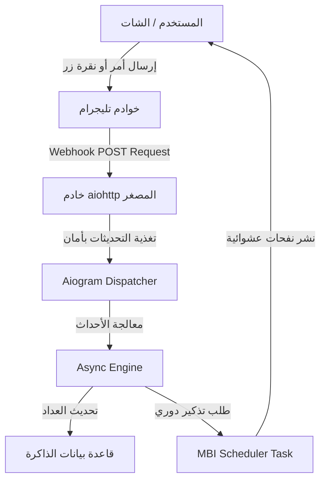

<p align="center">
  
</p>

<p align="center">
  <br><br>
  <b>🌟 صَدَقَةٌ جَارِيَةٌ رَقْمِيَّةٌ 🌟</b><br>
  <sub>مِنَ التَّشَتُّتِ إِلَى الذِّكْرِ • وَمِنَ الضَّيَاعِ إِلَى الأَثَرِ</sub>
</p>

---


<p align="center">
  
</p>

<p align="center">
  <b>🌟 صَدَقَةٌ جَارِيَةٌ رَقْمِيَّةٌ 🌟</b><br>
  <sub>مِنَ التَّشَتُّتِ إِلَى الذِّكْرِ • وَمِنَ الضَّيَاعِ إِلَى الأَثَرِ</sub>
</p>

---

<p align="center">
  
  
  
  
</p>

--- 

## 💡 فكرة المشروع

**نُورِفَاي (Noorify)** هو بوت تيليجرام تفاعلي متطور يهدف إلى دمج الأذكار والعبادات اليومية في حياة المستخدم الرقمية بأسلوب سلس ومحفز، معتمداً على هندسة برمجية غير متزامنة بالكامل لضمان السرعة والكفاءة العالية.

* **📿 مسبحة إلكترونية متطورة:** نظام تسبيح رقمي ذكي مزود بشريط تقدم تفاعلي ورتب روحية متغيرة.
* **✨ نظام بث تلقائي:** ميزة الجدولة الدورية للأذكار في المجموعات لمشرفي القنوات والمجموعات مع حماية من الحظر.
* **📊 إحصائيات دقيقة:** تحليل ذكي لمعدل الذكر اليومي لتشجيع العادات الحميدة وتقليل الإدمان الرقمي.
* **🌐 جاهز للنشر الفوري:** مهيأ بالكامل للتشغيل عبر الـ Webhook وخوادم Render أو Railway.

---

## 🧠 المعمارية والنظام الداخلي

يتكامل البوت من خلال دورة حياة غير متزامنة تتعامل مع التحديثات الواردة من واجهة برمجية تيليجرام بكفاءة:



--- 
## 🧩 حزمة التقنيات والبنية البرمجية (Tech Stack)

تم اختيار وهندسة حزمة التقنيات الخاصة ببوت **نُورِفَاي** بعناية فائقة لضمان أقصى درجات الكفاءة، الاستجابة السريعة، الحفاظ على موارد الخادم، ومعالجة الطلبات المتزامنة دون أي تأخير (Zero-Lag):

### 🛠️ لغة البرمجة وبيئة التطوير الأساسية (Core Engine)
<table width="100%">
  <tr>
    <td align="center" width="25%">
      <br>
      <b>Python 3.13+</b><br>
      <sub>البيئة الأساسية وميزات إدارة الذاكرة الحديثة</sub>
    </td>
    <td align="center" width="25%">
      <br>
      <b>Git</b><br>
      <sub>إدارة النسخ والتحكم بالمصدر</sub>
    </td>
    <td align="center" width="25%">
      <br>
      <b>GitHub Actions</b><br>
      <sub>استضافة المستودع وإدارة الشيفرة</sub>
    </td>
    <td align="center" width="25%">
      <br>
      <b>Linux OS</b><br>
      <sub>البيئة التشغيلية المستهدفة للخوادم</sub>
    </td>
  </tr>
</table>

### 📦 الإطارات والمكتبات الهندسية (Frameworks & Libraries)

<p align="left">
  <a href="https://docs.aiogram.dev/">
    
  </a>
  <a href="https://docs.aiohttp.org/">
    
  </a>
  <a href="https://pypi.org/project/python-dotenv/">
    
  </a>
  <a href="https://mermaid.js.org/">
    
  </a>
</p>

* **`Aiogram 3.x`**: إطار عمل حديث مبني بالكامل على مفهوم البرمجة غير المتزامنة (`Asynchronous / Asyncio`) للتعامل مع واجهة برمجية تليجرام، مما يتيح معالجة آلاف الأحداث (Events) في نفس الثانية بكفاءة خطية $O(1)$.
* **`Aiohttp (Web Server)`**: خادم ويب داخلي عالي الأداء وموفر للطاقة يُستخدم لإنشاء الـ `Webhook Endpoint` لاستقبال البيانات من تليجرام فورياً ودون الحاجة لعمليات الفحص الدوري (`Polling`) المستهلكة للمعالج.
* **`Python-Dotenv`**: لتأمين مفاتيح الربط والتوكنات (`Environment Variables`) وعزل البيانات الحساسة تماماً عن شيفرة المصدر الأساسية باتباع منهجية *Twelve-Factor App*.

### 🌐 البنية التحتية وهندسة الشبكات (Infrastructure & Architecture)

<p align="center">
  
  
  
  
</p>

* **نمط الشبكة (`Webhook Pattern`)**: استقبال الأحداث عبر اتصالات آمنة مشفرة (`HTTPS POST`) لضمان سرعة نقل لا تتعدى أجزاء من الملي ثانية.
* **إدارة المهام الخلفية (`Background Broadcaster Task`)**: نظام جدولة ذكي مبني كلياً داخل حلقة أحداث بايثون (`Event Loop`) يعمل في الخلفية لبث التذكيرات الدورية للمجموعات دون تعطيل تفاعل المستخدمين مع المسبحة أو القوائم.
* **الحماية من الحظر (`Flood/Rate Limit Protection`)**: تضمين فترات تأخير ميكروية مدمجة (`asyncio.sleep`) لتفادي قيود خوادم تليجرام الصارمة عند النشر الجماعي.

---

## ⚙️ دليل التثبيت والتشغيل المحلي

### 1️⃣ المتطلبات الأساسية

* بيئة عمل **Python 3.13** أو أحدث.
* رمز توكن البوت الصادر من **BotFather**.

### 2️⃣ التثبيت وإعداد المتغيرات

قم باستنساخ المستودع، وتثبيت المكتبات المطلوبة:

```bash
# استنساخ المشروع من جيت هاب
git clone [https://github.com/RamiAILab/Noorify_Bot](https://github.com/RamiAILab/Noorify_Bot)
cd Noorify_Bot

# تثبيت الحزم والمكتبات الاعتمادية
pip install -r requirements.txt

```

قم بإنشاء ملف `.env` في المجلد الرئيسي للمشروع وضع داخله الإعدادات التالية:

```env
TOKEN= ضع التكون هنا 
PORT=8080
WEBHOOK_HOST=[https://your-app-name.onrender.com](https://your-app-name.onrender.com)

```

### 3️⃣ تشغيل المشروع محلياً

```bash
python main.py

```

---

## 🔗 المنصات والروابط الرسمية (Official Links)

تفضل بزيارة منصاتنا الرسمية للتواصل، متابعة التحديثات، أو استخدام البوت مباشرة عبر الروابط المهيكلة أدناه:

<table width="100%">
  <tr>
    <td align="center" width="25%" style="background-color: #0f2027;">
      <br><br>
      <a href="https://t.me/Noorify_bot">
        
      </a><br>
      <b><a href="https://t.me/Noorify_bot">ابدأ استخدام البوت</a></b><br>
      <sub>رابط الوصول المباشر آلياً</sub>
    </td>
    <td align="center" width="25%" style="background-color: #0f2027;">
      <br><br>
      <a href="https://t.me/RamiAILab">
        
      </a><br>
      <b><a href="https://t.me/RamiAILab">قناتنا التقنية</a></b><br>
      <sub>متابعة آخر الحلول والابتكارات</sub>
    </td>
    <td align="center" width="25%" style="background-color: #0f2027;">
      <br><br>
      <a href="https://github.com/rambos2003-lab/Noorify_Bot">
        
      </a><br>
      <b><a href="https://github.com/rambos2003-lab/Noorify_Bot">كود المشروع</a></b><br>
      <sub>مراجعة الشيفرة والمساهمة</sub>
    </td>
    <td align="center" width="25%" style="background-color: #0f2027;">
      <br><br>
      <a href="https://linktr.ee/ramibitar.dev">
        
      </a><br>
      <b><a href="https://linktr.ee/ramibitar.dev">بوابة المطور</a></b><br>
      <sub>حساباتي وشبكاتي الاجتماعية</sub>
    </td>
  </tr>
</table>

### 👤 المطور والمسؤول التقني
* **المهندس:** رامي بيطار (Rami Bitar)
* **المستودع الشخصي للمطور على GitHub:** [RamiAIlab](https://github.com/RamiAIlab)

---

## 🎯 أهداف المشروع الإستراتيجية

* **الحد من التشتت الرقمي:** توجيه اهتمام تصفح الهاتف إلى طاعات مستمرة.
* **بناء العادات المستدامة:** ترسيخ مفهوم الأذكار اليومية من خلال الأشرطة التنافسية.
* **الأثر الاجتماعي الصالح:** تمكين المجموعات العامة من التحول إلى مجالس ذكر رقمية مباركة.

---

## 🤍 صدقة جارية

> "الدال على الخير كفاعله"
> إذا ألهمك هذا المشروع أو ساهم في بناء عاداتك الروحية، فلا تبخل علينا وعلى مبرمجي المشروع بدعوة صالحة بظهر الغيب. 🤍

---

## ⭐ دعم وتطوير المشروع

يسعدنا جداً دعمك للمشروع من خلال الضغط على زر النجمة **Star** في أعلى صفحة المستودع للمساهمة في نشره ووصوله لأكبر عدد ممكن من المطورين والمستخدمين.
