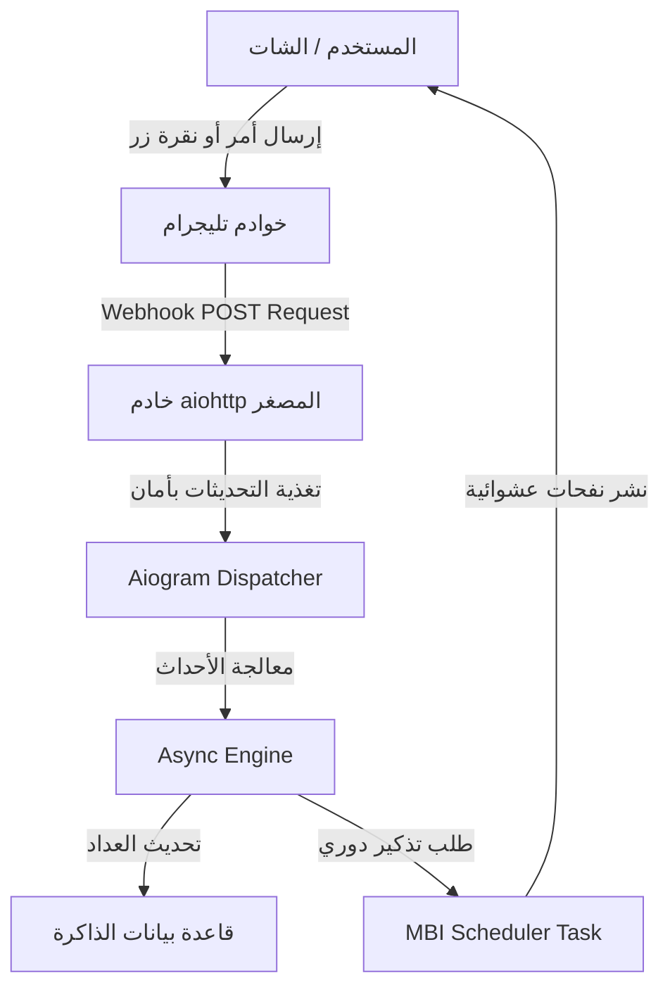

<p align="center">
  
</p>

<p align="center">
  <b>🌟 صَدَقَةٌ جَارِيَةٌ رَقْمِيَّةٌ 🌟</b><br>
  <sub>مِنَ التَّشَتُّتِ إِلَى الذِّكْرِ • وَمِنَ الضَّيَاعِ إِلَى الأَثَرِ</sub>
</p>

---

<p align="center">
  
  
  
  
</p>

--- 

## 💡 فكرة المشروع

**نُورِفَاي (Noorify)** هو بوت تيليجرام تفاعلي متطور يهدف إلى دمج الأذكار والعبادات اليومية في حياة المستخدم الرقمية بأسلوب سلس ومحفز، معتمداً على هندسة برمجية غير متزامنة بالكامل لضمان السرعة والكفاءة العالية.

* **📿 مسبحة إلكترونية متطورة:** نظام تسبيح رقمي ذكي مزود بشريط تقدم تفاعلي ورتب روحية متغيرة.
* **✨ نظام بث تلقائي:** ميزة الجدولة الدورية للأذكار في المجموعات لمشرفي القنوات والمجموعات مع حماية من الحظر.
* **📊 إحصائيات دقيقة:** تحليل ذكي لمعدل الذكر اليومي لتشجيع العادات الحميدة وتقليل الإدمان الرقمي.
* **🌐 جاهز للنشر الفوري:** مهيأ بالكامل للتشغيل عبر الـ Webhook وخوادم Render أو Railway.

---

## 🧠 المعمارية والنظام الداخلي

يتكامل البوت من خلال دورة حياة غير متزامنة تتعامل مع التحديثات الواردة من واجهة برمجية تيليجرام بكفاءة:



---

## 🧩 حزمة التقنيات المستخدمة

---

## ⚙️ دليل التثبيت والتشغيل المحلي

### 1️⃣ المتطلبات الأساسية

* بيئة عمل **Python 3.13** أو أحدث.
* رمز توكن البوت الصادر من **BotFather**.

### 2️⃣ التثبيت وإعداد المتغيرات

قم باستنساخ المستودع، وتثبيت المكتبات المطلوبة:

```bash
# استنساخ المشروع من جيت هاب
git clone [https://github.com/rambos2003-lab/Noorify_Bot](https://github.com/rambos2003-lab/Noorify_Bot)
cd Noorify_Bot

# تثبيت الحزم والمكتبات الاعتمادية
pip install -r requirements.txt

```

قم بإنشاء ملف `.env` في المجلد الرئيسي للمشروع وضع داخله الإعدادات التالية:

```env
TOKEN=1234567890:ABCdefGhIJKlmNoPQRsTUVwxyZ
PORT=8080
WEBHOOK_HOST=[https://your-app-name.onrender.com](https://your-app-name.onrender.com)

```

### 3️⃣ تشغيل المشروع محلياً

```bash
python main.py

```

---

## 🔗 الروابط الرسمية للمشروع

---

## 🎯 أهداف المشروع الإستراتيجية

* **الحد من التشتت الرقمي:** توجيه اهتمام تصفح الهاتف إلى طاعات مستمرة.
* **بناء العادات المستدامة:** ترسيخ مفهوم الأذكار اليومية من خلال الأشرطة التنافسية.
* **الأثر الاجتماعي الصالح:** تمكين المجموعات العامة من التحول إلى مجالس ذكر رقمية مباركة.

---

## 🤍 صدقة جارية

> "الدال على الخير كفاعله"
> إذا ألهمك هذا المشروع أو ساهم في بناء عاداتك الروحية، فلا تبخل علينا وعلى مبرمجي المشروع بدعوة صالحة بظهر الغيب. 🤍

---

## ⭐ دعم وتطوير المشروع

يسعدنا جداً دعمك للمشروع من خلال الضغط على زر النجمة **Star** في أعلى صفحة المستودع للمساهمة في نشره ووصوله لأكبر عدد ممكن من المطورين والمستخدمين.
