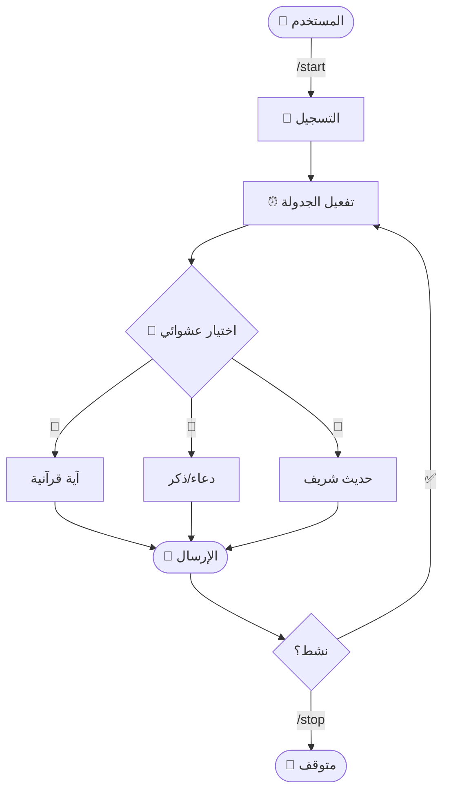

<div align="center">
 

 
[](https://t.me/Noorify_bot)
[](https://python.org)
[](LICENSE)
[]()

</div>

## 🌙 نبذة عن المشروع

بوت تيليغرام ذكي يرسل تذكيرات إسلامية يومية (آيات قرآنية، أدعية، أحاديث) بجدولة تلقائية دقيقة. يعمل في الدردشات الخاصة والمجموعات والقنوات مع تحكم كامل من قبل المستخدم.

---

## ✨ المميزات الأساسية

| الميزة | الوصف |
|:---:|:---|
| 🔔 **تذكيرات عشوائية** | آيات وأدعية وأحاديث غير متكررة يومياً |
| ⏰ **جدولة ذكية** | تعمل تلقائياً في أوقات محددة بدقة |
| 💬 **دعم شامل** | دردشات خاصة، مجموعات، قنوات |
| 🎛️ **تحكم سهل** | أزرار بسيطة للتحكم الكامل |
| 🔄 **بدون تكرار** | خوارزمية ذكية تمنع تكرار المحتوى |
| 📊 **قاعدة بيانات** | تخزين آمن للبيانات |

---

## 🏗️ البنية التقنية



---

## 🛠️ التقنيات المستخدمة

| التقنية | الإصدار | الدور |
|:---|:---:|:---|
| **Aiogram** | 3.x | إطار عمل بوتات Telegram |
| **APScheduler** | 3.x | جدولة المهام والتذكيرات |
| **AsyncIO** | Built-in | معالجة غير متزامنة |
| **SQLite** | 3.x | قاعدة البيانات |
| **Python** | 3.11+ | لغة البرمجة |

---

## 🚀 البدء السريع

### المتطلبات
- Python 3.11+
- pip
- Bot Token من [@BotFather](https://t.me/BotFather)

### التثبيت

```bash
# استنساخ المشروع
git clone https://github.com/RamiDevX/Noorify_Bot.git
cd Noorify_Bot

# إنشاء بيئة افتراضية
python -m venv venv
source venv/bin/activate  # Linux/macOS
# أو
venv\Scripts\activate  # Windows

# تثبيت المكتبات
pip install -r requirements.txt
```

### إعداد `.env`

```env
TOKEN="YOUR_BOT_TOKEN_HERE"
DATABASE_URL="sqlite:///noorify.db"
ADMIN_ID=123456789
TIMEZONE="Asia/Riyadh"
INTERVAL_MIN=60
```

### التشغيل

```bash
python main.py
```

---

## 📖 أوامر البوت الأساسية

| الأمر | الوصف |
|:---|:---|
| `/start` | تفعيل التذكيرات |
| `/stop` | إيقاف التذكيرات |
| `/resume` | استئناف التذكيرات |
| `/status` | عرض الحالة الحالية |
| `/help` | عرض قائمة الأوامر |

---

## 🤝 المساهمة

```bash
# Fork المشروع
git clone https://github.com/YOUR_USERNAME/Noorify_Bot.git

# إنشاء فرع جديد
git checkout -b feature/ميزة-جديدة

# احفظ التغييرات
git commit -m "✨ feat: إضافة ميزة جديدة"

# ادفع إلى GitHub
git push origin feature/ميزة-جديدة

# افتح Pull Request
```

---

## 👨‍💻 المطور

<div align="center">

**Rami Bitar** — RamiDevX

[](https://github.com/RamiDevX)
[](https://t.me/ramidevx)
[](https://linkedin.com/in/ramibitar)

</div>

---

## 📚 مصادر مفيدة

- [📖 Aiogram Documentation](https://docs.aiogram.dev/)
- [⏰ APScheduler Documentation](https://apscheduler.readthedocs.io/)
- [🤖 Telegram Bot API](https://core.telegram.org/bots/api)
- [⚡ Python AsyncIO](https://docs.python.org/3/library/asyncio.html)

---

## 📜 الترخيص

مرخص تحت [MIT License](LICENSE) - استخدم وعدّل بحرية ✨

---

<div align="center">


**صُنع بإخلاص ❤️** | NoorifyBot © 2026

⭐ *إذا أعجبك المشروع، أضف نجمة لتشجيع التطوير*

</div>
