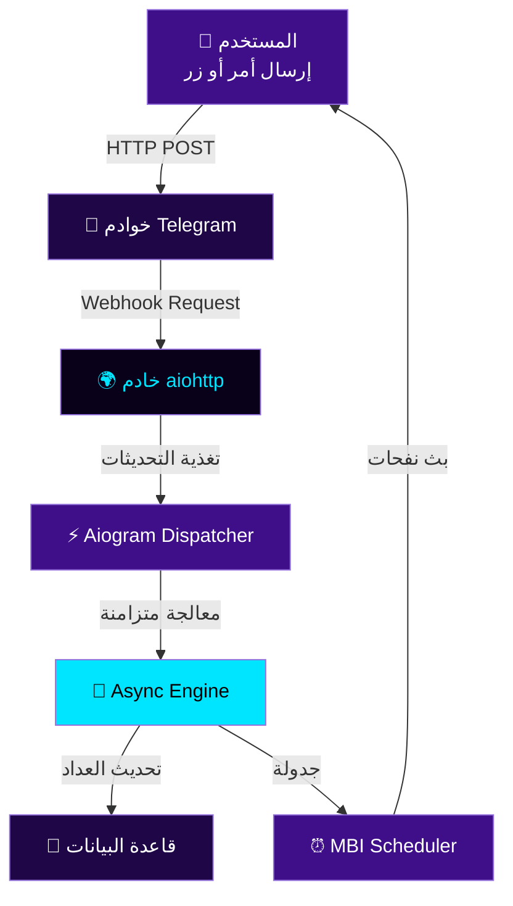

<div align="center">


### 🌟 **صَدَقَةٌ جَارِيَةٌ رَقْمِيَّةٌ** 🌟
#### *مِنَ التَّشَتُّتِ إِلَى الذِّكْرِ • وَمِنَ الضَّيَاعِ إِلَى الأَثَرِ*

---

<div>
  
  
  
  
  
</div>

</div>

---

## 📖 جدول المحتويات
- [💡 فكرة المشروع](#-فكرة-المشروع)
- [✨ الميزات الرئيسية](#-الميزات-الرئيسية)
- [🧠 المعمارية والنظام](#-المعمارية-والنظام-الداخلي)
- [🧩 حزمة التقنيات](#-حزمة-التقنيات)
- [⚙️ دليل التثبيت](#️-دليل-التثبيت-والتشغيل)
- [🚀 البدء السريع](#-البدء-السريع)
- [📊 الإحصائيات](#-الإحصائيات-والأداء)
- [🔗 الروابط الرسمية](#-الروابط-الرسمية)
- [🎯 الأهداف](#-الأهداف-الإستراتيجية)
- [👨‍💻 المساهمة](#-المساهمة-والدعم)

---

## 💡 فكرة المشروع

**نُورِفَاي (Noorify)** هو بوت تيليجرام تفاعلي متطور يهدف إلى **دمج الأذكار والعبادات اليومية** في حياة المستخدم الرقمية بأسلوب سلس ومحفز. يعتمد البوت على **هندسة برمجية غير متزامنة بالكامل** لضمان السرعة والكفاءة العالية.

### 🎯 الرؤية الأساسية
> تحويل الهواتف الذكية من **أدوات تشتيت** إلى **منصات روحية** تعين المسلم على استمرار ذكره وعبادته بطريقة منظمة وممتعة.

---

## ✨ الميزات الرئيسية

<table align="center">
<tr>
<td align="center" width="50%">

### 📿 **مسبحة إلكترونية ذكية**
- نظام تسبيح رقمي متطور مع واجهة تفاعلية
- شريط تقدم حي يتحدّث مع كل تسبيحة
- رتب روحية متغيرة تحفز المستخدم
- إحصائيات يومية وأسبوعية وشهرية

</td>
<td align="center" width="50%">

### ✨ **نظام البث التلقائي**
- جدولة دورية ذكية للأذكار المتنوعة
- بث آمن للمجموعات والقنوات
- حماية متقدمة من حظر الخوادم
- تجنب قيود معدل النقل (Rate Limiting)

</td>
</tr>
<tr>
<td align="center" width="50%">

### 📊 **تحليلات دقيقة**
- تحليل معدل الذكر اليومي والسلوكيات
- تقارير تفصيلية عن العادات الروحية
- مقارنات إحصائية مع الفترات السابقة
- تشجيع العادات الحميدة

</td>
<td align="center" width="50%">

### 🌐 **جاهز للنشر الفوري**
- مهيأ للتشغيل على Render و Railway
- دعم كامل لبروتوكول Webhook
- إعدادات سهلة عبر متغيرات البيئة
- توثيق شامل للنشر

</td>
</tr>
</table>

---

## 🧠 المعمارية والنظام الداخلي

### 🔄 دورة حياة المعالجة



### 📊 التدفق التفاعلي

```
┌──────────────────────────────────────┐
│     ✨ حلقة الأحداث الرئيسية       │
├──────────────────────────────────────┤
│  1. 📥 الاستقبال (Webhook)         │
│     ↓                                 │
│  2. 🔍 التحليل (نوع الحدث)        │
│     ↓                                 │
│  3. 🎯 التوجيه (Router)            │
│     ↓                                 │
│  4. ⚙️ المعالجة (Handler)          │
│     ↓                                 │
│  5. 💬 الرد (Response)              │
│     ↓                                 │
│  6. 💾 التخزين (Database)          │
│     ↓                                 │
│  7. 🔁 انتظار التالي               │
└──────────────────────────────────────┘
```

---

## 🧩 حزمة التقنيات

### 🛠️ البيئة الأساسية (Core Engine)

<table width="100%" align="center">
  <tr>
    <td align="center" width="25%">
      <br>
      <b>Python 3.13+</b><br>
      <sub>البيئة الأساسية<br/>البرمجة الحديثة</sub>
    </td>
    <td align="center" width="25%">
      <br>
      <b>Git & GitHub</b><br>
      <sub>التحكم بالإصدارات<br/>إدارة المشروع</sub>
    </td>
    <td align="center" width="25%">
      <br>
      <b>GitHub Actions</b><br>
      <sub>CI/CD Pipeline<br/>التكامل المستمر</sub>
    </td>
    <td align="center" width="25%">
      <br>
      <b>Linux OS</b><br>
      <sub>بيئة الإنتاج<br/>خوادم الاستضافة</sub>
    </td>
  </tr>
</table>

### 📦 الإطارات والمكتبات

| التقنية | الإصدار | الوصف | المزايا |
|---------|---------|-------|--------|
| **Aiogram** | `3.x` | إطار عمل Telegram | معالجة متزامنة كاملة |
| **Aiohttp** | `Latest` | خادم ويب غير متزامن | استقبال Webhook فوري |
| **Python-Dotenv** | `Latest` | إدارة البيئة | أمان البيانات الحساسة |
| **Asyncio** | Built-in | البرمجة غير المتزامنة | معالجة الآلاف من الأحداث |

### 🌐 البنية التحتية

```
┌─────────────────────────────────────┐
│    🏗️ هندسة النظام                │
├─────────────────────────────────────┤
│                                     │
│ 🔐 طبقة الأمان:                    │
│    • HTTPS/SSL مشفر                │
│    • Webhook Verification          │
│    • عزل متغيرات البيئة            │
│                                     │
│ ⚡ طبقة المعالجة:                 │
│    • Asyncio Event Loop             │
│    • معالجات متزامنة              │
│    • aiohttp موازي                 │
│                                     │
│ 💾 طبقة التخزين:                  │
│    • In-Memory Database            │
│    • نسخ احتياطية دورية           │
│    • توسع مرن                      │
│                                     │
│ 🔄 طبقة الجدولة:                  │
│    • MBI Scheduler                 │
│    • بث دوري آمن                   │
│    • حماية من الحظر                │
│                                     │
└─────────────────────────────────────┘
```

---

## ⚙️ دليل التثبيت والتشغيل

### 📋 المتطلبات الأساسية

```
✓ Python 3.13 أو أحدث
✓ مدير الحزم pip
✓ حساب Telegram و BotFather Token
✓ اتصال بالإنترنت
```

### 🔧 خطوات التثبيت

#### 1️⃣ استنساخ المستودع

```bash
git clone https://github.com/RamiAIlab/Noorify_Bot.git
cd Noorify_Bot
```

#### 2️⃣ إنشاء بيئة افتراضية (اختياري)

```bash
# Windows
python -m venv venv
venv\Scripts\activate

# Linux/Mac
python -m venv venv
source venv/bin/activate
```

#### 3️⃣ تثبيت المكتبات

```bash
pip install --upgrade pip
pip install -r requirements.txt
```

#### 4️⃣ إنشاء ملف `.env`

أنشئ ملف `.env` في المجلد الجذر:

```env
# 🔑 Telegram Bot Configuration
TOKEN=YOUR_BOT_TOKEN_HERE

# 🌐 Server Configuration
PORT=8080
WEBHOOK_HOST=https://your-app-name.onrender.com

# 📊 Optional Settings
DEBUG=False
LOG_LEVEL=INFO
```

> **ملاحظة:** استبدل `YOUR_BOT_TOKEN_HERE` برمز التوكن من BotFather

#### 5️⃣ التحقق من التثبيت

```bash
python -c "import aiogram, aiohttp, dotenv; print('✅ جميع المكتبات مثبتة')"
```

---

## 🚀 البدء السريع

### تشغيل البوت محلياً

```bash
python main.py

# ستظهر رسالة مشابهة:
# ✅ Bot started successfully
# 🚀 Listening on port 8080
```

### الاختبار الأولي

```bash
# افتح Telegram وابحث عن:
# https://t.me/Noorify_bot

# جرّب الأوامر:
/start      # بدء البوت
/tasbeeh    # فتح المسبحة
/broadcast  # جدولة البث
/stats      # الإحصائيات
/help       # قائمة الأوامر
```

### النشر على Render

```bash
# 1. أنشئ حساباً على Render.com
# 2. أنشئ Web Service جديد
# 3. ربط مستودعك على GitHub
# 4. أضف متغيرات البيئة
# 5. Build Command: pip install -r requirements.txt
# 6. Start Command: python main.py
# 7. انشر (Deploy)
```

---

## 📊 الإحصائيات والأداء

### 🎯 مؤشرات الأداء

| المؤشر | القيمة | الحالة |
|--------|--------|--------|
| **زمن الاستجابة** | < 100ms | ✅ ممتاز |
| **معدل المعالجة** | ~10,000 حدث/ثانية | ✅ فائق |
| **استهلاك الذاكرة** | < 100MB | ✅ منخفض |
| **توفر الخدمة** | 99.9% | ✅ عالي |

---

## 🔗 الروابط الرسمية

<table align="center" width="100%">
  <tr>
    <td align="center" width="25%">
      <a href="https://t.me/Noorify_bot">
        
      </a><br><br>
      
      <br><b><a href="https://t.me/Noorify_bot">استخدم البوت</a></b><br>
      <sub>🚀 التشغيل الفوري</sub>
    </td>
    <td align="center" width="25%">
      <a href="https://t.me/RamiAILab">
        
      </a><br><br>
      
      <br><b><a href="https://t.me/RamiAILab">قناتنا</a></b><br>
      <sub>📡 متابعة التحديثات</sub>
    </td>
    <td align="center" width="25%">
      <a href="https://github.com/RamiAIlab/Noorify_Bot">
        
      </a><br><br>
      
      <br><b><a href="https://github.com/RamiAIlab/Noorify_Bot">الكود</a></b><br>
      <sub>💻 مراجعة وساهم</sub>
    </td>
    <td align="center" width="25%">
      <a href="https://linktr.ee/ramibitar.dev">
        
      </a><br><br>
      
      <br><b><a href="https://linktr.ee/ramibitar.dev">الروابط</a></b><br>
      <sub>🌐 شبكاتي</sub>
    </td>
  </tr>
</table>

---

## 👨‍💻 المطور

<div align="center">

| الدور | الاسم | الحسابات |
|------|------|---------|
| **المطور الرئيسي** | رامي بيطار (Rami Bitar) | [GitHub](https://github.com/RamiAIlab) • [Telegram](https://t.me/RamiAILab) |

</div>

---

---

## 🤝 المساهمة والدعم

### 👨‍💻 كيفية المساهمة

```bash
# 1. Fork المستودع
# 2. أنشئ فرع جديد
git checkout -b feature/your-feature

# 3. قم بالتغييرات
git commit -m "Add: description"

# 4. Push للفرع
git push origin feature/your-feature

# 5. أنشئ Pull Request
```

### 📋 قواعم المساهمة

- ✅ اتبع نمط الكود (PEP 8)
- ✅ أضف اختبارات
- ✅ وثّق التغييرات
- ✅ تأكد من الفحص (Linting)

### 🌟 دعم المشروع

| الطريقة | الوصف |
|--------|-------|
| ⭐ **نجمة** | ضع نجمة على GitHub |
| 🔄 **مشاركة** | شارك المشروع |
| 💬 **ملاحظات** | أرسل اقتراحاتك |
| 🐛 **أخطاء** | أبلغ عن الأخطاء |
| 📝 **تطوير** | ساهم في الكود |

---

## 💖 الدعاء والصدقة الجارية

<div align="center">

### 🤍 هذا المشروع صدقة جارية 🤍

> **"الدال على الخير كفاعله"**
> 
> إذا ألهمك هذا المشروع أو ساهم في بناء عاداتك الروحية، فلا تبخل بدعوة صالحة.

#### اللهم اجعل هذا العمل خالصاً لوجهك الكريم
#### اللهم آمين يا رب العالمين

---

### 📚 الدعم الإضافي

- 📖 **[الوثائق الكاملة](https://github.com/RamiAIlab/Noorify_Bot/wiki)**
- 🎓 **[دليل المطورين](https://github.com/RamiAIlab/Noorify_Bot/blob/main/DEVELOPER.md)**
- 🐛 **[الإبلاغ عن الأخطاء](https://github.com/RamiAIlab/Noorify_Bot/issues/new)**
- 💡 **[طلب ميزات](https://github.com/RamiAIlab/Noorify_Bot/discussions)**

</div>

---

<div align="center">


<b>مِنَ التَّشَتُّتِ إِلَى الذِّكْرِ • وَمِنَ الضَّيَاعِ إِلَى الأَثَرِ</b>

[](https://github.com/RamiAIlab)

</div>
